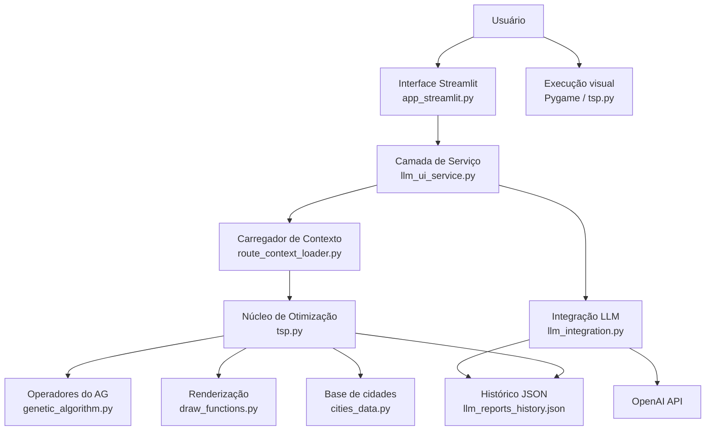
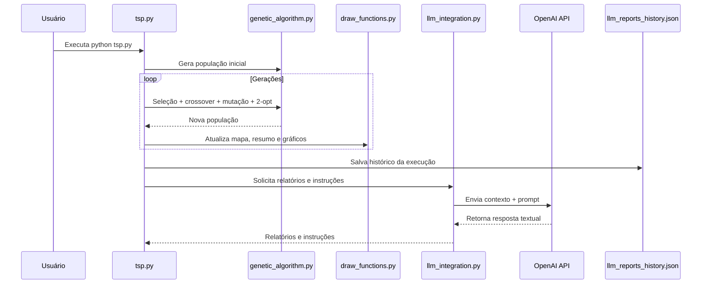
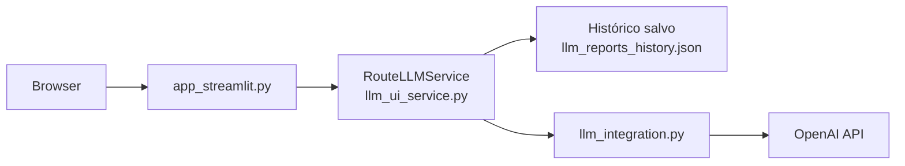
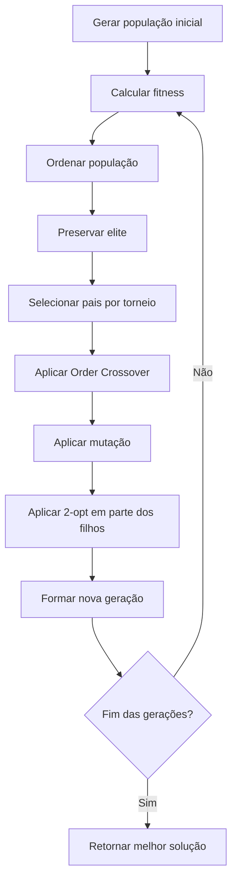

# Sistema de Otimização de Rotas com Algoritmo Genético e LLM

## Visão geral

Este projeto implementa uma solução acadêmica de **otimização de rotas** inspirada no problema do **TSP (Travelling Salesman Problem)** e evoluída para um cenário mais próximo de **VRP (Vehicle Routing Problem)**. A aplicação combina:

- **Algoritmo Genético (AG)** para busca de soluções de roteamento;
- **múltiplos veículos** com capacidades e restrições distintas;
- **função fitness multicritério**, considerando distância, custo, prioridade e penalidades;
- **visualização em Pygame** para acompanhar a execução do algoritmo;
- **integração com LLM** para responder perguntas em linguagem natural, gerar relatórios e produzir recomendações operacionais;
- **interface web em Streamlit** para consulta das rotas de forma interativa.

O objetivo é demonstrar, em um contexto de pós-graduação em IA, como técnicas de computação evolucionária podem ser combinadas com IA generativa para construir uma solução mais explicável e mais próxima de um sistema real de apoio à decisão logística.

---

## Objetivos do projeto

- Resolver um problema de roteamento com base em cidades reais da região de São Paulo.
- Distribuir entregas entre **3 veículos** com características diferentes.
- Minimizar a fitness global da operação, considerando:
  - distância percorrida;
  - custo operacional;
  - prioridade de cidades críticas;
  - penalidades por violação de restrições.
- Permitir que o usuário consulte o resultado por meio de perguntas em linguagem natural.
- Gerar **relatórios diários, semanais e sugestões de melhoria** usando LLM.

---

## Tecnologias utilizadas

- **Python 3.10+**
- **Pygame** — visualização da execução principal
- **Streamlit** — interface web para consulta com LLM
- **Matplotlib** — gráficos de evolução da fitness
- **Algoritmo Genético** — otimização heurística
- **OpenAI API** — geração de relatórios e respostas em linguagem natural
- **JSON** — persistência simples do histórico de execuções

---

## Arquitetura da solução

A solução foi organizada em camadas para separar responsabilidades e facilitar manutenção, testes e apresentação acadêmica.

### Diagrama de arquitetura lógica



### Diagrama de execução do fluxo principal



### Diagrama da interface web com LLM



---

## Estrutura do projeto

```text
.
├── app_streamlit.py            # Interface web para perguntas sobre as rotas
├── benchmark_att48.py          # Benchmark auxiliar herdado da base do projeto
├── cities_data.py              # Base de cidades e dados geográficos/logísticos
├── COMENTARIOS_METODOLOGIA.md  # Material explicativo complementar
├── draw_functions.py           # Funções de desenho do mapa, gráficos e painéis
├── genetic_algorithm.py        # Operadores do Algoritmo Genético
├── llm_integration.py          # Integração com OpenAI e geração de relatórios
├── llm_reports_history.json    # Histórico persistido das execuções
├── llm_ui_service.py           # Camada de serviço para UI + LLM
├── README.md                   # README principal do projeto
├── README_ptbr.md              # Versão em português já existente
├── requirements_ui.txt         # Dependência da interface Streamlit
├── route_context_loader.py     # Ponte entre GA e interface web
├── tsp.py                      # Núcleo do problema de otimização e execução visual
├── execution_screen.png        # Captura da última execução
└── fitness_evolution.png       # Gráfico salvo da evolução da fitness
```

---

## Descrição dos principais módulos

### `tsp.py`
É o núcleo da solução. Esse arquivo concentra:

- parâmetros globais do problema;
- definição dos veículos;
- construção das cidades;
- avaliação das soluções;
- evolução da população ao longo das gerações;
- atualização visual com Pygame;
- persistência do histórico;
- chamada da camada de LLM para relatórios e instruções.

### `genetic_algorithm.py`
Implementa os operadores fundamentais do AG:

- geração da população inicial;
- cálculo de fitness base;
- seleção por torneio;
- crossover OX (**Order Crossover**);
- mutação por swap ou inversão;
- refinamento local com **2-opt**.

### `draw_functions.py`
Responsável pela interface visual da execução principal:

- desenho das cidades;
- desenho das rotas;
- painel lateral com métricas;
- gráfico de evolução;
- exportação do gráfico final.

### `llm_integration.py`
Conecta o resultado do AG a uma LLM via OpenAI API. Esse módulo gera:

- respostas para perguntas em linguagem natural;
- relatório diário;
- relatório semanal;
- instruções para motoristas;
- sugestões de melhoria do processo.

### `route_context_loader.py`
Faz a ponte entre o algoritmo e a interface web. A principal vantagem é executar o fluxo necessário para a UI sem depender diretamente da janela gráfica do Pygame.

### `llm_ui_service.py`
Implementa a camada de serviço da aplicação web. Essa camada:

- centraliza a regra de negócio usada pela UI;
- carrega o histórico salvo;
- faz cache dos resultados;
- desacopla o Streamlit da lógica de roteamento.

### `app_streamlit.py`
É a interface web interativa. Permite:

- carregar o contexto salvo da última execução;
- visualizar um resumo das rotas;
- fazer perguntas em linguagem natural;
- consultar respostas da LLM de forma rápida.

---

## Modelagem do problema

O projeto trabalha com uma adaptação de TSP para VRP simplificado.

### Elementos do problema

- **1 depósito base**
- **20 cidades** selecionadas da base de dados
- **3 veículos** com perfis diferentes
- **restrições operacionais** por veículo
- **prioridade de entregas**

### Veículos definidos

#### Veículo 1 — Pequeno
- capacidade: 190
- distância máxima: 280 km
- tempo máximo de trabalho: 420 min
- custo operacional: 1.00 por km
- custo fixo: 15.0
- bônus para cidades críticas: 8.0

#### Veículo 2 — Médio
- capacidade: 320
- distância máxima: 520 km
- tempo máximo de trabalho: 540 min
- custo operacional: 1.12 por km
- custo fixo: 25.0
- bônus para cidades críticas: 14.0

#### Veículo 3 — Grande
- capacidade: 520
- distância máxima: 900 km
- tempo máximo de trabalho: 660 min
- custo operacional: 1.28 por km
- custo fixo: 35.0
- bônus para cidades críticas: 18.0

---

## Técnica de Inteligência Artificial utilizada

A técnica central utilizada no projeto é o **Algoritmo Genético (AG)**, uma meta-heurística inspirada em evolução natural.

### Representação do indivíduo

Cada indivíduo da população representa uma **permutação global das cidades**. Em vez de pré-definir uma rota fixa por veículo, o algoritmo trabalha com uma sequência global e um decoder posterior distribui essa sequência entre os veículos conforme restrições e características da frota.

Esse é um ponto importante do projeto, porque aumenta a flexibilidade da modelagem e aproxima a solução de um cenário real de logística.

### Etapas do AG

#### 1. População inicial
O algoritmo cria várias soluções aleatórias, cada uma contendo uma permutação válida das cidades.

#### 2. Avaliação por fitness
Cada solução é avaliada considerando múltiplos critérios.

#### 3. Seleção
Foi utilizada **seleção por torneio**, que escolhe alguns indivíduos aleatoriamente e seleciona o melhor entre eles.

#### 4. Crossover
Foi utilizado o **Order Crossover (OX)**, apropriado para problemas de permutação como TSP/VRP, pois mantém a ordem relativa e evita duplicidades.

#### 5. Mutação
A mutação pode ocorrer por:
- **swap** entre duas posições;
- **inversão** de um trecho da rota.

#### 6. Melhoria local
O projeto aplica **2-opt** em parte das soluções para refinar localmente o caminho e remover cruzamentos desnecessários.

#### 7. Elitismo
Os melhores indivíduos são preservados para evitar regressão entre gerações.

### Fluxo do AG



---

## Função fitness

A fitness do projeto foi modelada para ser **multicritério**. O objetivo não é apenas minimizar a distância, mas obter uma solução operacionalmente melhor.

### Componentes avaliados

- distância percorrida;
- custo operacional do veículo;
- penalidades por exceder restrições;
- penalidades por atendimento inadequado;
- bônus por atendimento de cidades críticas.

### Interpretação

**Quanto menor a fitness, melhor a solução.**

Isso significa que uma rota mais curta pode não ser a melhor se ela violar capacidade, autonomia ou tempo máximo de trabalho.

---

## Persistência e histórico

O projeto salva no arquivo `llm_reports_history.json` o histórico das execuções, incluindo métricas agregadas e resultados detalhados por veículo.

Esse histórico é usado para:

- exibir resumos na interface web;
- alimentar relatórios diários e semanais;
- responder perguntas sobre a última execução;
- evitar recomputação desnecessária na UI.

---

## Como executar o projeto

## Pré-requisitos

- Python **3.10 ou superior**
- Pip instalado
- Ambiente virtual recomendado

---

## 1. Clonar o repositório

```bash
git clone <URL_DO_REPOSITORIO>
cd <NOME_DO_REPOSITORIO>
```

---

## 2. Criar e ativar o ambiente virtual

### Windows (PowerShell)

```powershell
python -m venv .venv
.\.venv\Scripts\Activate.ps1
```

### Windows (CMD)

```cmd
python -m venv .venv
.venv\Scripts\activate
```

### Linux / macOS

```bash
python3 -m venv .venv
source .venv/bin/activate
```

---

## 3. Instalar dependências

### Dependências da execução principal

```bash
pip install pygame matplotlib numpy
```

### Dependências da interface web

```bash
pip install -r requirements_ui.txt
```

> Observação: o arquivo `requirements_ui.txt` contém a dependência do Streamlit. Se necessário, você pode instalar também manualmente:
>
> ```bash
> pip install streamlit
> ```

---

## 4. Configurar a chave da OpenAI

Para usar os recursos de LLM, crie um arquivo `.env` na raiz do projeto com o conteúdo abaixo:

```env
OPENAI_API_KEY=sua_chave_aqui
OPENAI_MODEL=gpt-4o-mini
```

### Exemplo de `.gitignore`

```gitignore
.venv/
.env
__pycache__/
*.pyc
```

> Importante: não publique a chave da API no GitHub.

---

## 5. Executar a aplicação principal

A execução principal roda o AG com visualização em Pygame, mostra a evolução da solução e ao final salva os artefatos visuais.

```bash
python tsp.py
```

### Saídas esperadas

Ao final da execução, o projeto pode gerar:

- `execution_screen.png` — print da tela final;
- `fitness_evolution.png` — gráfico final da evolução da fitness;
- atualização do `llm_reports_history.json` — histórico persistido;
- relatórios e instruções no terminal, se a LLM estiver configurada.

---

## 6. Executar a interface Streamlit

A interface web consulta o histórico salvo e permite perguntas em linguagem natural.

```bash
streamlit run app_streamlit.py
```

### No PowerShell, se necessário

```powershell
& ".\.venv\Scripts\python.exe" -m streamlit run app_streamlit.py
```

Depois disso, abra no navegador o endereço exibido no terminal, normalmente:

```text
http://localhost:8501
```

---

## 7. Ordem recomendada de execução

Para usar todos os recursos corretamente, a ordem recomendada é:

1. configurar a `.env` com a API key;
2. executar `python tsp.py` para gerar resultados e salvar o histórico;
3. executar `streamlit run app_streamlit.py` para consultar as rotas e os relatórios.

---

## Parâmetros do projeto

Os parâmetros principais do AG estão em `tsp.py`.

### Exemplo atual

```python
POPULATION_SIZE = 90
N_GENERATIONS = 15
MUTATION_PROBABILITY = 0.22
ELITISM = 2
TOURNAMENT_SIZE = 6
```

### Observações

- populações maiores tendem a gerar soluções melhores, porém com maior custo computacional;
- mais gerações aumentam a exploração e o refinamento;
- mutação mais alta aumenta diversidade, mas pode prejudicar convergência se exagerada.

Na UI Streamlit, o serviço também pode usar variáveis de ambiente para ajustar performance:

```env
STREAMLIT_GA_POPULATION=8
STREAMLIT_GA_GENERATIONS=10
```

Esses valores são úteis quando se deseja uma resposta mais rápida no ambiente web.

---

## Resultados apresentados

Durante a execução principal, o projeto exibe:

- mapa com as cidades;
- rotas por veículo com cores distintas;
- legenda da frota;
- painel com resumo das rotas;
- gráficos de evolução da fitness e métricas operacionais.

Na interface Streamlit, o usuário pode:

- carregar o resumo das rotas;
- fazer perguntas como “Qual a melhor rota do veículo 1?”;
- consultar sugestões e relatórios gerados pela LLM.

---

## Exemplos de perguntas para a LLM

- Qual é a melhor rota do veículo 1?
- Qual veículo ficou com o menor percurso?
- Quais cidades críticas estão na operação?
- Gere um resumo das rotas do dia.
- Quais melhorias a LLM sugere?

---

## Pontos fortes do projeto

- combina otimização heurística com IA generativa;
- modela restrições próximas de um cenário real;
- usa arquitetura em camadas;
- possui visualização clara da evolução do algoritmo;
- permite consulta em linguagem natural;
- gera documentação operacional automática.

---

## Limitações atuais

- a solução ainda é uma aproximação acadêmica de VRP, não um motor logístico de produção;
- não há integração com APIs reais de mapas ou trânsito;
- a persistência foi mantida simples em JSON;
- a qualidade da resposta da LLM depende da chave configurada e da disponibilidade da API.

---

## Melhorias futuras

- incluir janelas de tempo mais rígidas;
- integrar mapas reais e distâncias por rota viária;
- permitir múltiplos depósitos;
- adicionar exportação em PDF/CSV;
- incluir testes automatizados unitários e de integração;
- comparar AG com outras heurísticas, como simulated annealing, tabu search ou OR-Tools.

---

## Conclusão

Este projeto demonstra de forma prática como um **Algoritmo Genético** pode ser aplicado à otimização de rotas com múltiplos critérios e múltiplos veículos, e como os resultados podem ser enriquecidos por uma **LLM** para tornar a solução mais explicável, interativa e útil para tomada de decisão.

Além do valor técnico, a solução também tem valor acadêmico por integrar:

- modelagem de problema;
- meta-heurística de otimização;
- visualização computacional;
- arquitetura de software;
- IA generativa aplicada.

---

## Autor

**Fernando Monin**  
Projeto acadêmico desenvolvido para estudos de **Inteligência Artificial** e **otimização de rotas**.
